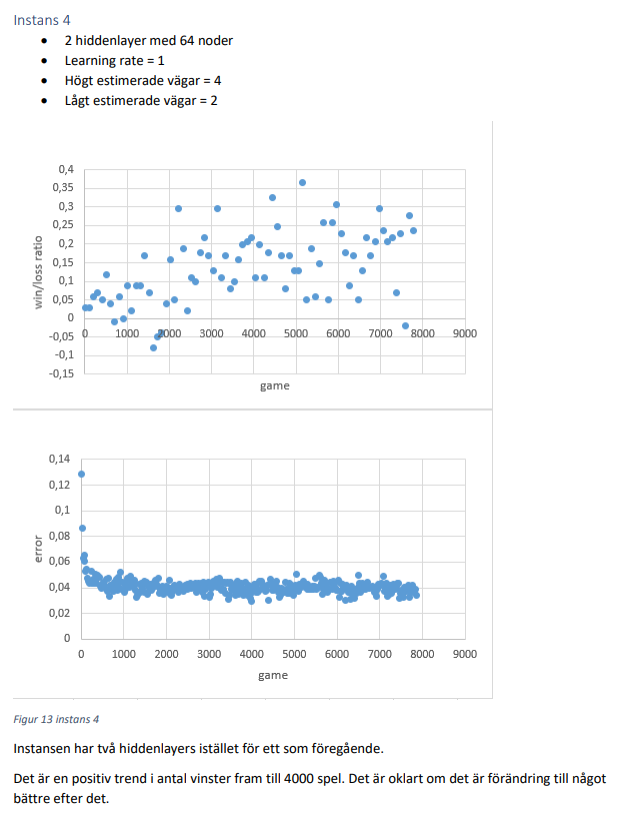

# Truck-Delivery-AI
This was a school project. I have implemented an AI to learn to play Truck Delivery against a BOT. The BOT is constant and can not evolve, but the AI will evolve when playing the game. A neural network combined with monte carlo tree search decides what move should be made.  The result of this project is documented in a report, written in swedish.   
An AI training to beat the BOT in Truck Delivery. Inpired by alpha zero, I wanted to create an AI that was could learn to play my game  
  
Win/loss result example  

  

<object data="https://github.com/JohanHaggmark/Truck-Delivery-AI/blob/master/AI_i_turodningsbaserat_spel_c17johha.pdf" type="application/pdf" width="700px" height="700px">
    <embed src="https://github.com/JohanHaggmark/Truck-Delivery-AI/blob/master/AI_i_turodningsbaserat_spel_c17johha.pdf">
        
This browser does not support PDFs. Please download the PDF to view it: <a href="https://github.com/JohanHaggmark/Truck-Delivery-AI/blob/master/AI_i_turodningsbaserat_spel_c17johha.pdf">Download PDF</a>.

    </embed>
</object>
